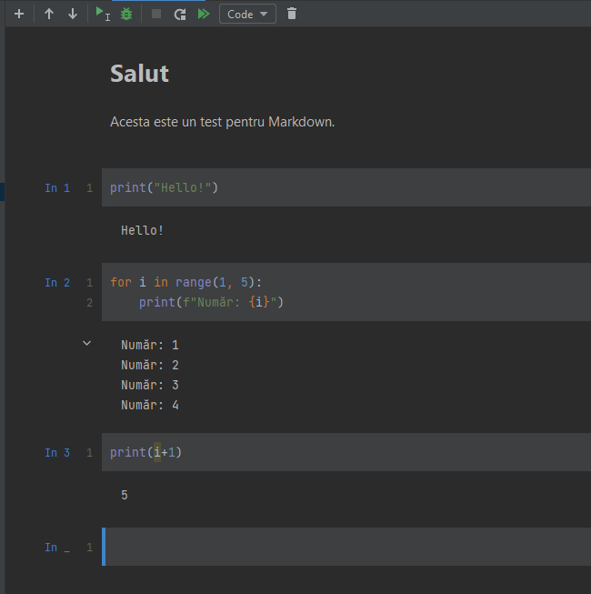
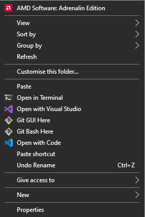
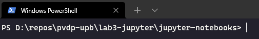
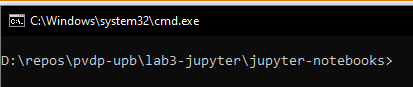
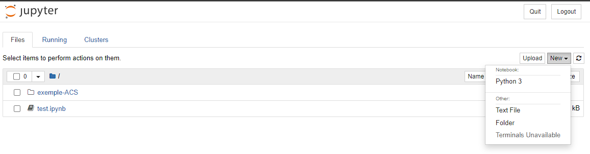
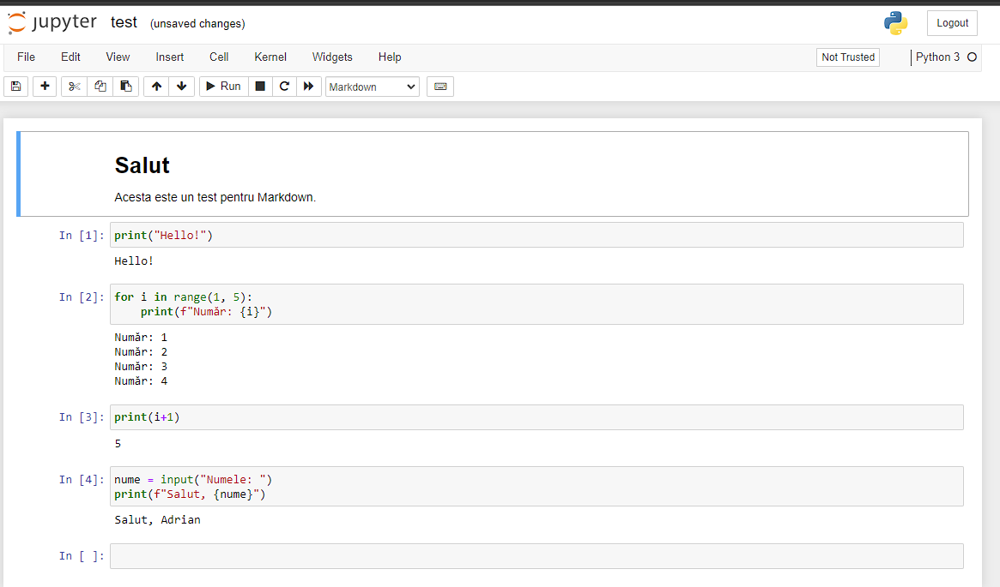

# Jupyter

Sistemul Jupyter, cunoscut anterior sub numele IPython (de la *Interactive Python*)
este foarte folositor pentru *programare interactivă*. Cu alte cuvinte, în loc să
scriem separat codul, în cîte un fișier, pe care să-l rulăm și documentația separat,
Jupyter ne oferă posibilitatea de a combina codul cu documentația în același document.

Și Markdown -- sistemul folosit pentru a scrie această documentație -- poate afișa cod,
ca de exemplu:
```python
print("Salut!")
```
Dar acest cod *nu poate fi executat*, ci doar afișat.

Denumirea de Jupyter provine de la faptul că în cadrul acestui sistem se pot folosi
cu ușurință 3 limbaje foarte folositoare:
- [Julia](https://julialang.org/) -- esențial în fizică și alte discipline care prelucrează date experimentale;
- [Python](https://www.python.org/) -- limbaj flexibil, general;
- [R](https://www.r-project.org/) -- limbaj foarte folosit în statistică și inteligență artificială, unde se lucrează cu instrumente statistice avansate.

Între timp, proiectul a avansat și acceptă foarte multe alte limbaje,
dar ele trebuie instalate individual. Vezi [aici](https://github.com/jupyter/jupyter/wiki/Jupyter-kernels).

**Noi vom lucra doar cu Python, care este instalat automat.**

## Instalare și mod de lucru
Site-ul proiectului Jupyter este [aici](https://jupyter.org/).

### PyCharm
**Observație:** PyCharm, versiunea Community (gratuită pentru toată lumea) permite
foi Jupyter *doar în sistem read-only*, deci nu le veți putea edita.
Aveți alternativa să descărcați versiunea pro, folosind adresa de email `@upb`, cu care
vă înregistrați pentru un cont gratuit. Indicațiile de mai jos presupun această metodă.
Alternativa fără PyCharm urmează.

Aveți, în secțiunea [Install](https://jupyter.org/install) indicațiile corespunzătoare.

Vom instala pachetul `Jupyterlab`, care conține tot ce este necesar:
- deschideți Terminal-ul din PyCharm (sau consola din Windows);
- introduceți comanda `pip install jupyterlab` și apăsați `Enter`, urmărind progresul instalării.

Pentru test și utilizare, creați un fișier cu extensia `.ipynb` (exemplu: `test.ipynb`).
PyCharm îl va recunoaște ca folosind Jupyter și veți vedea o interfață nouă, ca mai jos:



Imaginea corespunde fișierului de [aici](./jupyter-notebooks/test.ipynb).

**Observație 1:** Codurile „comunică“ între ele, astfel că, la blocul `In 3`, unde am folosit din nou
variabila `i`, este folosită cea din blocul `In 2`.

Observați că sursa este evaluată cu ajutorul *blocurilor*. În stînga, blocurile sînt indicate ca fiind
blocuri de intrare `In`, iar dedesubt, găsiți rezultatul execuției lor. Mai mult, în partea de sus
puteți vedea o selecție care corespunde tipului blocului: `Code` sau `Markdown`.

### Terminal & Browser
Puteți instala și utiliza Jupyter și fără PyCharm, astfel:
- deschideți Windows Terminal sau Command Prompt din Start;
- introduceți comanda `pip install jupyterlab` și așteptați finalizarea instalării.

Apoi, pentru utilizare, navigați în directorul unde veți păstra foile Jupyter. Puteți face aceasta
în una dintre variantele:
- navigați din terminal cu comanda `cd` (change directory) pînă în directorul dorit (exemplu: `cd D:\proiecte\pvdp`);
- navigați din Windows Explorer către directorul dorit apoi:
  + dacă aveți Windows Terminal instalat, apăsați click dreapta în directorul din Explorer și alegeți `Open in Terminal` ca în imagine: ;
  + dacă nu aveți Windows Terminal instalat, copiați calea de director din Explorer apăsînd `Ctrl + L`, apoi `Ctrl + C` și deschideți Command Prompt apăsînd `Windows + R` și scrieți `cmd`, apoi apăsați `Enter`. După ce se deschide Command Prompt, scrieți `cd` și apoi introduceți cu `Ctrl + V` calea de director copiată și apăsați `Enter`.

**Nu continuați pînă cînd Windows Terminal sau Command Prompt nu vă arată că sînteți în directorul dorit!**. 
Exemplu din Windows Terminal:  și din Command Prompt: .

Dacă directorul nu se schimbă în Command Prompt, modificați comanda adăugînd `/d`, 
adică, de exemplu, `cd /d D:\proiecte\pvdp`.

Din directorul respectiv, introduceți comanda `jupyter notebook` și apăsați Enter.
Se va deschide o fereastră de browser ca mai jos, care vă va arăta fișierele din directorul respectiv.



Din meniul `New > Python 3` veți crea o foaie nouă.



---

Urmăriți [documentația PyCharm](https://www.jetbrains.com/help/pycharm/jupyter-notebook-support.html) 
sau demonstrația din cadrul cursului (și rezultatul în [demo.ipynb](./jupyter-notebooks/demo.ipynb)).

Veți avea nevoie și de [sintaxa Markdown](https://www.markdownguide.org/basic-syntax).

## Exerciții
Scopul acestui curs & laborator este să vă familiarizați cu noul mod de lucru.
Astfel că principala cerință va fi să lucrați exemple simple în noul format,
folosind cît mai multe elemente.

De exemplu, **elemente de bază**:
- asigurați-vă că ați instalat corect Jupyter;
- creați o foaie de lucru `ipynb`;
- introduceți un bloc de text și „rulați-l“ cu `Shift + Enter` (exemplu `Test bloc text.`);
- introduceți un bloc de cod și rulați-l cu `Shift + Enter` (exemplu `print("Salut!")`).

Apoi, **elemente intermediare**:
- folosiți cît mai multe tipuri de conținut în blocul text:
  + heading (titlu, subtitlu etc., cu sintaxa `# Titlu` pentru titlu, `## Subtitlu` pentru subtitlu etc.);
  + text **bold**, cu sintaxa `**text**`;
  + text *italic*, cu sintaxa `*text*`;
  + text `preformatat`, stil cod, cu sintaxa `` `text` ``;
  + [link](https://tcsi.ro/), cu sintaxa `[text](URL)`;
  + liste numerotate și nenumerotate;
- blocurile de cod să facă unele calcule simple: 
  + afișați toți multiplii de 13 de la 1 la 100;
  + afișați numerele prime de la 1 la 100;
  + afișați toate pătratele perfecte de la 1 la 1000.
  + afișați toate numerele prime dintr-un interval `[a,b]`, cu capetele citite de la tastatură (puteți folosi `input()` într-un bloc de cod);
  + afișați 10 numere aleatorii *diferite* între 1 și 100.

---

## Exerciții suplimentare (13 aprilie 2022)
Rezolvați toate exercițiile de mai jos într-o singură foaie Jupyter cu titlul (heading 1): `Exerciții în Jupyter`.

- scrieți un bloc Markdown care să conțină ca titlu (heading 2) `Exercițiul 1: Lucrul cu text`;
- în același bloc Markdown introduceți un citat (blockquote) de pe Wikipedia și introduceți-i sursa cu un link de tipul [link](https://en.wikipedia.org/wiki/James_Rumsey_Monument);
- scrieți un bloc Markdown care să conțină descrierea: Codul de mai jos numără caracterele din citatul de mai sus;
- scrieți un bloc Python care să preia de la tastatură sau dintr-un fișier citatul din bloc și să afișeze cîte caractere conține; executați blocul și afișați rezultatul;
- scrieți încă un bloc Markdown care să conțină descrierea: Codul de mai jos numără aparițiile unui caracter introdus de la tastatură din citatul de mai sus. *Varianta non-case-sensitive*;
- scrieți un bloc Python care să rezolve cerința și să afișeze rezultatul;
- scrieți încă un bloc Markdown care să conțină descrierea: **Varianta case-sensitive**;
- scrieți un bloc Python care să rezolve cerința.

---

- scrieți un bloc Markdown care să conțină ca titlu (heading 2) `Exercițiul 2: Lucrul cu numere prime`;
- în același bloc Markdown introduceți un tabel cu 2 coloane, de forma:

| Număr `n` | Al `n`-lea număr prim |
|-----------|-----------------------|
| 1         | 2                     |
| 2         | 3                     |
| 3         | 5                     |
| 4         | 7                     |
| 5         | 11                    |

- scrieți un bloc Markdown care să conțină descrierea: Codul de mai jos afișează primele `n` numere prime, cu `n` citit de la tastatură;
- scrieți un bloc Python care să rezolve cerința.

---

- scrieți un bloc Markdown care să conțină ca titlu (heading 2) `Exercițiul 3: Loto 6/49`;
- în același bloc Markdown introduceți o imagine sugestivă pentru o loterie, precum ;
- scrieți un bloc Markdown care să conțină descrierea: Codul de mai jos vă permite alegerea a 6 numere de la 1 la 49, apoi face o extragere aleatorie și afișează cîte numere ați ghicit;
- scrieți un bloc Python care să rezolve cerința:
  - citiți de la tastatură 6 numere de la 1 la 49 și le salvați într-o listă `jucator`;
  - faceți o extragere de 6 numere diferite de la 1 la 49 (folosind modulul `random` și funcția `random.randint(1, 49)`) și le salvați într-o listă `extragere`;
  - verificați cîte numere din lista `jucator` se găsesc în lista `extragere`;

---

- scrieți un bloc Markdown care să conțină ca titlu (**heading 3**) `Exercițiul 4: Mai multe bilete, mai multe șanse de cîștig!`;
- scrieți un bloc Markdown care să conțină descrierea: Codul de mai jos vă permite să jucați mai multe seturi de numere, salvate într-un fișier și afișează cîte numere ați ghicit la fiecare bilet. Exemplu:
```
inFile.txt
----------------
1 5 7 31 44 14
41 22 5 33 23 11
11 12 13 6 4 31

OUTPUT:
--------------------------
Extragere: 5 7 31 22 32 21
Bilet 1: 3 ghicite
Bilet 2: 1 ghicit
Bilet 3: 1 ghicit

```
- scrieți un bloc Python care să rezolve cerința:
  - salvați într-un fișier un număr (> 1) de seturi de cîte 6 numere, de la 1 la 49;
  - preluați numerele din fișier într-o singură listă, cu toate biletele, pe care o spargeți în liste de cîte 6 elemente, cîte o listă pentru fiecare bilet;
  - realizați o extragere folosind `random.randint(1, 49)`;
  - verificați cîte numere extrase se găsesc în fiecare dintre listele corespunzătoare biletelor;
  - **Puncte bonus dacă refolosiți elemente (funcții, variabile) din blocul anterior, fără a le copia, evident.**